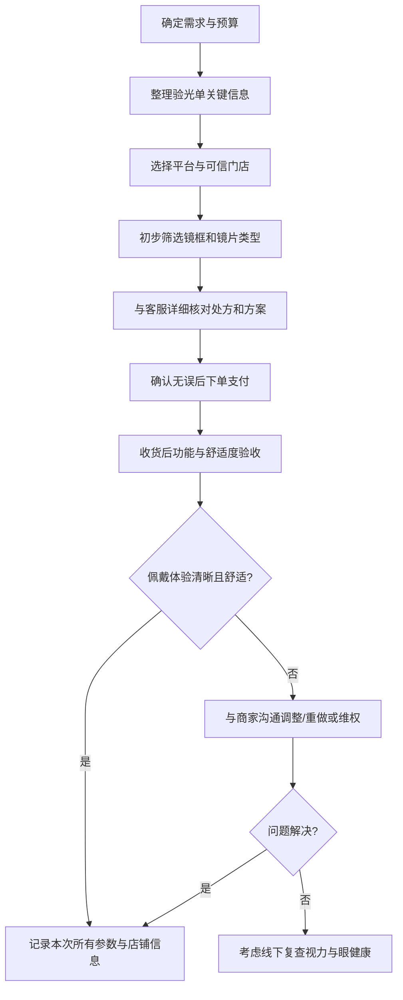

线上配眼镜：认知架构与 SOP
================================

前提：你已经在正规机构完成验光，有有效的验光单（含球镜、柱镜、轴位、瞳距等）。

本文件解决两个问题：
- 线上配眼镜的「认知架构」：我在做一件什么事？真正的风险和控制点在哪里？
- 可执行的「流程化 SOP」：按步骤走，就不容易踩坑。

==总原则：线上配镜的本质是“在看不到你脸和眼的情况下，用一张处方 + 若干参数来远程加工一副合理的工具”。所有关键点都围绕“信息是否充分、对方是否专业、结果是否可验证”展开。==

一、认知架构：把线上配镜当成一个「远程加工项目」
--------------------------------------------

可以用「输入 → 加工 → 验收 → 调整」来理解。

- 输入层（你提供什么信息）
  - 验光信息：球镜（SPH）、散光/柱镜（CYL）、轴位（AXIS）、瞳距（PD）、（有条件时）瞳高。
  - 个人状态：年龄、用眼场景（办公/电脑/驾驶/运动）、是否有干眼、是否有斜视/弱视史、是否高度近视（>600 度）。
  - 需求与偏好：外观（框型、颜色）、重量舒适度、预算区间、是否需要防蓝光/变色/偏光等。
  - 平台约束：线上平台的售后规则（是否可重做、可退、运费谁承担）。

- 加工层（商家在做什么）
  - 用你的验光数据 + 你的脸型参数 + 镜框参数 → 选择镜片方案（品牌、材质、折射率、镀膜）。
  - 加工过程：切割、抛光、装片到镜框中，控制中心点与瞳距/瞳高匹配。
  - 他们的“专业程度”主要体现在：问什么问题、给什么解释、会不会拒绝不合理的需求。

- 输出层（你得到什么）
  - 物理成品：镜框 + 镜片。
  - 功能结果：看远/看近是否清晰、是否舒适、有无明显失真或眩晕。
  - 信息结果：是否拿到加工单/详细参数截图，方便下次复用或争议时举证。

- 控制层（你可以做的控制）
  - 事前控制：选平台、选店、选镜片方案（不要只看“便宜/防蓝光”）。
  - 事中控制：下单前反复核对关键参数，要求对方用文字确认；保存聊天记录。
  - 事后控制：收货后按照 checklist 验收；有问题在平台规则内立即沟通。

==关键认知 01：线上配镜的最大风险，不是“度数错一点”，而是「参数信息不全 + 沟通草率」导致整副眼镜的光学中心位置和使用场景不匹配，从而长期佩戴让眼睛更累。==

**第一步：选镜框**

- 在眼镜店试戴，记住型号/尺寸，网上买同款
    
- 或网上买3-5副试戴（很多店支持"试戴服务"，免费或付押金）
    
- **只选框，不配片**，不合适就退：**镜片宽 + 鼻梁宽）- 瞳距 ≤ 6**，越小越好。
    

**第二步：寄框配镜片**

- 确定要用的镜框后，寄给镜片商家
    
- 提供验光数据：**度数、散光、轴位、瞳距（PD）**
    
- 选镜片品牌（蔡司、依视路、明月、凯米等）和折射率
    

**第三步：加工收货**

- 镜片厂商收到你的框+数据后切割安装
    
- 一般3-7天完成，寄回成品
    

## 省钱技巧

|渠道|操作方式|优势|
|:--|:--|:--|
|1688/淘宝|自购镜框（100-300元）|框便宜，款式多|
|丹阳眼镜城（线上店）|寄框过去配镜片|镜片批发价，加工费低|
|品牌镜片官方店|买镜片送加工|正品保障|

**关键提醒：**

- 瞳距必须准！建议去医院验光（50-100元），数据最准
    
- 镜框材质选**纯钛、β钛、TR90**，轻且不易变形
    
- 保留好镜框购买凭证，万一加工坏了可索赔
二、整体流程图（Mermaid）
-------------------------

使用方式：可以在每一步给自己设一个「是否完成」的勾选框，避免漏掉关键确认环节。

三、SOP 总览：七个阶段
------------------

1. 明确需求与约束（你要什么样的眼镜）
2. 整理验光单与个人用眼信息
3. 选择平台与店铺
4. 筛选镜框与镜片方案
5. 与客服核对并锁定处方方案
6. 下单与等待加工
7. 收货、验收、适应与复检

下面按阶段展开，每一节会标出关键知识点。

四、阶段 1：明确需求与约束
---------------------

目的：从“配眼镜”变成“为具体场景配一个工具”。

- 使用场景分类
  - 以「远用」为主：走路、出门、看远处黑板、开车。
  - 以「近用」为主：电脑、手机、阅读。
  - 混合使用：通勤 + 办公，用时长都不短。

- 个人偏好与生理约束
  - 是否特别怕重、怕压鼻梁。
  - 是否容易晕车、对视觉环境变化敏感。
  - 职业危险性：需要戴安全帽、防护镜等。

- 预算区间
  - 粗分为：低预算（<300）、中等（300–800）、较高（800 以上）。
  - 不同预算主要影响：镜片品牌与光学素质、镀膜耐久度、售后服务质量。

==关键认知 02：先定义“这副眼镜主要为哪个场景服务”，再去配镜片与镜框。不要指望一副眼镜在所有场景都完美。==

五、阶段 2：整理验光单与个人用眼信息
-----------------------------

把原本分散在验光单和你脑子里的信息，整理成可以复制粘贴给客服的一段文字。

- 验光单关键信息（必要）
  - 左/右眼球镜（SPH）。
  - 左/右眼散光/柱镜（CYL）和轴位（AXIS）。这个部分之前验光的时候是没有这个数据的还是需要的
  - 瞳距（PD），最好分眼 PD（如 31/31），没有的话用总 PD（如 62）。
  - 验光时间、验光机构（医院/视光中心名称）。

==关键认知 03：越是在线上看不到你的真人，越要把“文字版的你”写得清楚。完整的信息是你对自己视力负责的第一步。==

六、阶段 3：选择平台与店铺
----------------------

目标：筛掉明显不靠谱的商家，把风险降低到可接受范围。

- 平台层面的考虑
  - 是否有 7 天无理由退货。
  - 是否有「配镜不适应可重做一次」的保障承诺。
  - 平台投诉与维权机制是否健全。

- 店铺筛选维度
  - 店铺评分：综合评分、售后服务评分。
  - 成交量：看「配镜相关」的真实销量，而不是所有商品总销量。
  - 差评内容：重点看「不适、头晕、度数不准」相关差评，以及商家回复态度。
  - 资质与背景：是否展示验光师/视光师资质、线下门店地址、营业执照。

- 试探性沟通
  - 问几个有技术含量的问题，例如：

==关键认知 04：一家好店的标志，不是“什么都能做”，而是会在条件不合适时明确说“不建议做”或“建议线下复查”。==

七、阶段 4：筛选镜框与镜片方案
---------------------------

这一步既影响外观，也影响佩戴舒适度和光学效果。

- 镜框：外观 + 功能的平衡
  - 材质：金属、板材、钛合金、TR 等。
    - 高度近视通常更适合轻一点的材质。
  - 尺寸：镜片宽度、鼻梁宽度、镜腿长度。
  - 框型：
    - 高度近视不建议选特别大、特别宽的框，否则镜片又厚又重。

- 镜片方案：几个关键维度
  - 折射率：如 1.56、1.60、1.67、1.71。
    - 度数越高、折射率可以适当更高，但折射率越高，通常阿贝数越低（成像色散更明显），不宜盲目追求最高。
  - 阿贝数（Abbe）：决定成像色散程度，越高越不容易有彩边。
  - 镀膜功能：
    - 防蓝光：有用但无需神化；不代表“护眼”，只是改变部分光谱。
    - 抗反射：提高通透性，减少眩光。
    - 防污防油：影响日常清洁便捷。
  - 品牌与系列：大厂通常在良品率和售后上更稳定，但也要看预算。

**鼻托**

- **一体式**（TR90/板材）：适合鼻梁高、不常调整
    
- **可调鼻托**（金属钛架）：适合鼻梁塌、需精细调整
    

**铰链**

- 普通铰链：易松动
    
- 弹簧铰链：镜腿外扩角度大（适合大头）
    
- 无螺丝设计：耐用但难修
    

**镜框类型**

- 全框：保护镜片、适合高度数
    
- 半框：轻、视野大、但镜片易崩边
    
- 无框：最轻、但所有冲击力直接到镜片
    

## 快速自检清单

- [ ] 戴上不夹太阳穴，低头不掉
    
- [ ] 瞳孔在镜片中心偏上1/3处（光学中心）
    
- [ ] 睫毛不刷镜片
    
- [ ] 镜腿不压耳后骨头

==关键认知 05：对高度近视来说，镜框大小的选择有时比“再加一点钱换更高折射率”更重要。控制镜片直径，就在控制厚度和重量。==

八、阶段 5：与客服核对并锁定方案
---------------------------

这是线上配镜中最关键的「沟通节点」。

- 必须明确写清楚/确认的项目
  - 验光数据（左/右眼 SPH、CYL、AXIS）。
  - 瞳距（PD），如有分眼 PD 要注明。
  - 用途：远用/近用/电脑为主/驾驶为主。
  - 镜片品牌与系列、折射率、是否防蓝光/变色等。
  - 镜框型号与尺寸。

- 建议你主动要求的两件事
  - 1）请对方把最终“加工依据”的处方文本发给你确认一次。
  - 2）请对方说明：如果佩戴明显不适，店铺的调整/重做政策是什么。

==关键认知 06：在下单之前，把所有关键信息锁定在“聊天记录里”，相当于写了一份“项目需求文档”，后续出现问题才有依据。==

九、阶段 6：下单与等待加工
-----------------------

- 下单前最后自检清单
  - 订单中显示的度数是否与验光单一致。
  - 镜片折射率、品牌、是否防蓝光等，是否与聊天确认一致。
  - 收货地址、姓名、电话是否无误。
  - 有无备注特殊要求（如「略微降低度数」等），是否和客服达成一致。

- 等待阶段可以做的事
  - 拍照或保存这次沟通的要点，方便以后配镜参考。
  - 预先规划一个「收货后 3–7 天」的适应观察期。

==关键认知 07：下单只是流程中间的一步，不是“放弃控制权”的时刻。你仍然可以通过平台消息随时确认进度和加工细节。==

十、阶段 7：收货、验收与适应
-------------------------

这一步决定你是否真的得到了一副“好用的工具”，而不是只是“到货的商品”。

- 开箱物理检查
  - 镜框有无明显瑕疵、划痕、松动。
  - 镜片表面有无划痕、脏污、镀膜缺陷。
  - 带在脸上：是否出现明显高低腿、歪斜。

- 功能与主观体验检查（建议在室内和室外各试一次）
  - 静止站立看远处：是否清晰、是否有明显重影。
  - 看手机/电脑：看 10–15 分钟，注意是否头晕、恶心、眼胀。
  - 走路：注意地面是否严重变形、脚下高度感是否失真。
  - 左右眼单眼分别遮盖测试：是否有一只眼明显更吃力。

- 适应期与异常判断
  - 一般轻度不适（轻微放大/缩小感、轻微空间扭曲）在 3–7 天内可逐渐适应。
  - 但如果：
    - 戴上 1–2 小时就头痛/恶心。
    - 走路明显不稳。
    - 一只眼始终明显模糊。
    - 远处看东西始终不清晰，不如旧眼镜。
  - 这类情况属于「异常」，不建议硬扛适应，应立即联系商家。

==关键认知 08：适应期存在，但“非常难受”不等于“正常适应”。持续强烈不适要尽早停用并排查原因。==

十一、出现问题时的排查与策略
-------------------------

1. 与商家沟通排查
   - 如实描述问题发生的场景、持续时间、与旧眼镜的差异。
   - 让对方复查：
     - 是否按你的验光单加工。
     - 是否有度数抄错、轴位抄错、双眼 PD 设错等情况。
   - 如对方愿意重做：
     - 询问是否需要重新验光或调整参数。
     - 确认重做的时间与费用承担方式（邮费谁出等）。

2. 线下复查
   - 若反复调整仍明显不适，
     - 重新验光，确认度数是否需要调整。

3. 个人策略层面的调整
   - 记录这次配镜经历中的关键数据与问题：
     - 哪种框型不适合你。
     - 哪种折射率、镜片类型你更容易适应。
   - 将这些信息写入「个人配镜档案」，以后线上/线下配镜都可以直接复用。

==关键认知 09：每一次配镜，都是在建立你的“个人视觉数据库”。你记录得越好，未来每一次决策的风险就越低。==

十二、快速 Checklist 总结
----------------------

可以在真正线上配镜时，把下面当成一个简化版流程单勾选：

- [ ] 已有正规验光单，时间在 1 年内。
- [ ] 明确这副眼镜的主要用途（远/近/电脑/驾驶等）。
- [ ] 整理好「文字版个人信息」：验光数据 + 用眼场景 + 特殊情况。
- [ ] 选定平台，并了解退货与重做规则。
- [ ] 筛选出 1–3 家「愿意认真沟通」的店铺。
- [ ] 初步选定镜框尺寸和大致镜片方案。
- [ ] 与客服确认所有关键参数，并保留文字记录。
- [ ] 下单前再次核对订单信息。
- [ ] 收货时完成物理与功能验收。
- [ ] 记录这次配镜的所有重要参数与体验感受。

==如果你已经验好光，现在就处于流程图中的「B→C→D」阶段：先把验光单和个人用眼情况整理为文本，然后去选平台/店铺，再筛框架和镜片。按照本文的流程一步步走，可以大幅降低线上配镜踩坑概率。==

附录一：折射率怎么选（按度数和框型）
-----------------------------

折射率选择的目标只有两个：
- 把镜片做得「够薄、够轻」；
- 同时不让成像质量（阿贝数）掉得太厉害。

可以用一个简化决策表来选：

- 近视度数在 -0～-3.00D 之间
  - 建议：1.50 或 1.56 单光镜片。
  - 解释：度数不高，1.50/1.56 厚度可接受，阿贝数相对更高，成像更自然。

- 近视度数在 -3.00D～-6.00D
  - 建议：1.56 或 1.60。
  - 如镜框偏大、脸较窄、希望更薄一点，可选 1.60。
  - 如更在乎成像舒适，更偏向 1.56。

- 近视度数在 -6.00D～-8.00D（中高度近视）
  - 建议：1.60 或 1.67。
  - 若框型适中、不追求极致薄：1.60 是比较均衡的选择。
  - 若框型略大或你对外观厚度很介意：1.67 可考虑，但要接受阿贝数略低。

- 近视度数在 -8.00D 以上（高度近视）
  - 建议：1.67 为主，有特殊需求再考虑 1.71。
  - 关键不是一味上折射率，而是：
    - 控制镜框大小（不要选大框）。
    - 尽量选全框或半框，而不是无框。

==关键认知 10：折射率不是越高越好，是在「度数」「框型大小」「预算」三者之间找平衡。==

附录二：镜片怎么选（功能与品牌）
---------------------------

一、先选「类别」，再选「品牌」

- 单光镜片
  - 适用：绝大多数普通近视、远视、散光人群。
  - 分为：远用单光、近用单光。

- 抗疲劳镜/中近职业镜片（有轻度渐进设计）
  - 适用：长时间使用电脑、阅读的人，尤其是 30 岁以上、感觉「以前度数不变但更容易累」的人。
  - 优点：在看中近距离时，眼睛调节负担略微减轻。
  - 注意：需要适应期，不适合每个人；如对空间变形特别敏感，要谨慎。

- 渐进多焦镜片（远中近三用）
  - 适用：老花 + 近视、需要一副眼镜走天下的人群。
  - 不建议线上首配。首次配渐进镜最好在线下由有经验的视光师全程指导。

- 特殊功能
  - 防蓝光：可选，但不必神化；不等于护眼，只是改变了一部分光谱。
  - 变色：室外变深、室内变浅，适合经常往返室内外的人。
  - 偏光：主要用于强光户外、驾驶等，减少眩光。

==关键认知 11：先确定你需要的是「单光 / 抗疲劳 / 渐进」，再谈品牌与促销。选择错误类别，再好的品牌也戴不舒服。==

二、镜片品牌的基本分层（按稳定性与价格）

以下是常见、较主流的品牌归类（并非广告，只是帮助你识别档次和风险）。不同地区、不同电商平台会有差异，你可以把这些名字当成「参考坐标系」：

- 国际大品牌（通常价格较高，但稳定性和售后较好）
  - 依视路（Essilor）
  - 豪雅（HOYA）
  - 蔡司（ZEISS）
  - 尼康（Nikon，部分地区有）
  - 罗敦司得（Rodenstock）等

- 国内知名品牌（性价比较高）
  - 明月
  - 万新
  - 宝岛自有品牌等

使用方式：
- 若预算允许、且这副眼镜戴的时长很高（每天 10 小时以上），可以倾向于国际大品牌或国内大厂的中高端系列。
- 若预算有限，可选国内知名品牌的主流系列，前提是店铺靠谱、加工规范。

==关键认知 12：品牌更多影响的是「一致性和售后」，真正决定你舒适度的仍是验光质量、参数设置和框型选择。==

附录三：镜框怎么选（外观以外的硬指标）
-------------------------------

一、镜框尺寸的三个核心参数

- 镜片宽度（一般以 mm 标示，如 50）
- 鼻梁宽度（如 18）
- 镜腿长度（如 140）

使用方法：
- 找出你现在戴着最舒服的一副眼镜，记下这三个数值。
- 线上选框时，把目标框的参数控制在「±2mm」以内，优先保证鼻梁宽度相近。

==关键认知 13：和脸合不合，比框好不好看更重要。鼻梁宽度不合适，会导致下滑、压痕、视轴偏离。==

二、材质与度数的匹配

- 高度近视（> -6.00D）
  - 优先：轻质金属（钛）、TR、部分高分子材质。
  - 尽量避免特别大的板材框、无框眼镜。
  - 推荐全框或半框，增加边缘遮挡，视觉上更“瘦”。

- 中等度数（-3.00D～-6.00D）
  - 材质选择空间较大：金属、板材、TR 都可。
  - 若脸较小，可选略窄一些的框，减少镜片直径。

- 低度数（>-3.00D）
  - 外观自由度最高。
  - 但仍要考虑重量和鼻托是否舒适。

三、结构细节要点

- 鼻托
  - 亚洲人通常更适合有可调鼻托（金属鼻托架 + 硅胶托）。
  - 一体式板材鼻梁设计好看，但容易压出红印或下滑。

- 镜腿
  - 是否易于调整弯曲角度。
  - 镜腿末端是否有包胶，提升稳定性和舒适度。

- 开合铰链
  - 是否顺滑，有无弹簧铰链设计（适合脸略宽的人）。

==关键认知 14：镜框本身就是一个「力学结构」。戴得稳、受力平均，你才有稳定的视轴和清晰的视野。==

附录四：综合选择策略（给你的实操模板）
--------------------------------

你可以按下面这套简化策略直接套用：

- 步骤 1：根据度数选折射率
  - -3.00D 以内：1.50/1.56
  - -3.00D～-6.00D：1.56/1.60
  - -6.00D～-8.00D：1.60/1.67
  - -8.00D 以上：1.67（特殊情况再考虑 1.71）

- 步骤 2：根据用途选镜片类别
  - 主要看远：远用单光。
  - 主要电脑 + 阅读：可考虑抗疲劳或中近职业型镜片。
  - 老花 + 近视：优先线下渐进多焦。

- 步骤 3：根据预算和佩戴时长选品牌档位
  - 每天佩戴时间 >8 小时：
    - 预算允许：国际大品牌的主流系列。
    - 预算有限：国内知名品牌中高端系列。
  - 偶尔佩戴：可选性价比更高的国内品牌基础系列。

- 步骤 4：镜框和脸的匹配
  - 用旧眼镜尺寸当基准，控制新框尺寸在 ±2mm 区间。
  - 高度近视避免大框，优先轻质全框/半框。
  - 确认鼻托、镜腿结构适合自己的鼻型和头型。

==关键认知 15：把选择拆解成“折射率 → 类别 → 品牌 → 框型”四步，你每一步都只是做一个小选择，而不是同时在脑子里扛几十个参数。==

