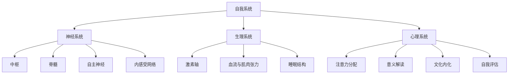
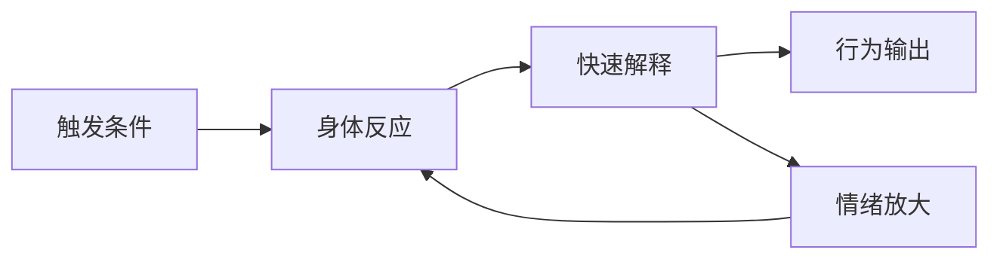
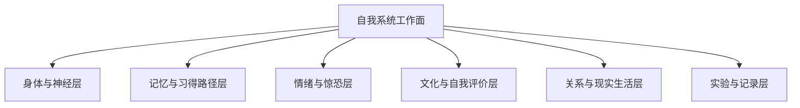

# 说明目的与讨论对象：把「我怎么又这样了」降到系统层

## 一、我为什么要写这份说明

### 1.1 当前困扰的基本图景

1. 长期困扰我的现象（遗精、前列腺液外溢、惊恐、睡眠不解乏、睡前口干等）在主观体验上是碎片化的。
2. 日常叙述容易停留在「这次又发生了」「感觉很糟」的层面，缺乏一个可以统一容纳的结构。

### 1.2 没有结构时会发生什么

3. 如果没有统一结构：
   - 每次发作都像是「一场新的灾难」；
   - 我很难判断哪些因素是核心变量，哪些只是噪音；
   - 很容易滑向「我这个人不行」「我意志力不够」这样的解释。

### 1.3 这份说明想完成的转变

4. 因此，需要一份把这些现象：
   - 从「单次事件」提升到「系统状态」；
   - 从「道德／习惯问题」提升到「神经—生理—心理一体化模式」的说明。

这份文档是在帮现在的我回答两个问题，留给未来的我反复对照：

1. 我到底在谈论一个什么样的「系统对象」？
2. 为什么我要用「系统」而不是「症状」「性格」「意志」的语言来描述它？

## 二、讨论对象：自我系统的工作定义

在这里，对我来说，「自我系统」不是哲学意义上的抽象自我，而是一个我可以当作工程对象来观察的整体：

### 2.1 它由哪些部分组成

1. 组成要素
   - 神经系统：中枢、脊髓、自主神经（交感／副交感）、内感受网络；
   - 生理系统：激素轴（HPA、HPG）、血流与肌肉张力分布、睡眠结构；
   - 心理系统：注意力分配、意义解读、文化内化、自我评估方式。

### 2.2 它是怎样在运转

2. 运行特征
   - 长期处于「低阈值＋高响应＋弱整合」状态；
   - 在关键时间窗（入睡前后、清晨）表现出高度脆弱性；
   - 对性相关刺激、压力、文化评价有显著放大反应。

### 2.3 我打算怎么观察它

3. 观察方式
   - 不再问「我是不是又失败了？」；
   - 而是问：「在什么条件下，这个系统更容易走向某种失稳模式？」

### 2.4 可视化：自我系统的组成结构

自我系统的工作定义是：  
在给定的历史、节律、文化和记忆背景下，身体与大脑如何以一套相对稳定的参数运行，并在压力下表现出可预测的倾向。

## 三、从症状列表到系统对象的跃迁

### 3.1 当我只看到「症状列表」的时候

1. 症状视角的问题
   - 列表化的方式会把遗精、惊恐、口干等看成一串互不相干的条目；
   - 每个条目都容易被单独道德化或病理化；
   - 我会被迫一次次「逐条解释」「逐条辩护」。
### 3.2 当我把它当成「一个系统」的时候

2. 系统视角的优势
   - 把所有输出（遗精、前列腺液外溢、惊恐等）视为同一系统在不同条件下的「出口」；
   - 可以在一张图里同时放进：
     - 历史条件化（过去的自慰路径）；
     - 当前节律（睡眠、作息、压力）；
     - 文化编码（羞耻、伤精观念）；
     - 生理阈值（脊髓兴奋性、盆底张力、自主神经基线）。
### 3.3 中间那一步「跃迁」到底是什么

3. 跃迁的本质
   - 从「发生了很多坏事」变成「一个可描述的状态模式」；
   - 从「我要对每个症状负责」变成「我在理解并调整一个系统」。

如果把这两种视角的差异画成一个简化流程，它更像这样：

未来的我每次再遇到类似事件时，可以先问一句：  
现在我站在这张流程图的哪一段？  
我能不能只调整其中一个环节，而不是把一切都算在「我这个人」头上？

## 四、走上这条路时我一定会碰到的几个层面

既然我选择用「系统」而不是「自责」的语言来面对这件事，那在路上我一定会遇到几个维度的工作：

### 4.1 六个我需要正面面对的工作面

1. 身体与神经层
   - 我会越来越频繁地注意到：心率、呼吸、体温、肌肉张力、盆底紧绷、入睡前的口干；
   - 我要练习把这些反应看成「参数读数」，而不是「我的错」；
   - 这一层会直接连到自主神经系统、性反射系统、睡眠结构这些模块。
2. 记忆与习得路径层
   - 旧的自慰回路、夜间体验、梦里的情节，会反复以各种方式重演；
   - 系统会本能地沿着「最熟悉的那条路」释放压力；
   - 我需要承认这条路曾经帮我活下来，同时慢慢给系统提供新的路径。
3. 情绪与惊恐层
   - 在某些夜晚，我还会再次遇到死亡感、失控感、强烈的惊恐体验；
   - 它们不仅是「多想」，而是身体、记忆和解释系统一起启动的结果；
   - 重要功课是：把惊恐当作「报警器」，而不是「审判书」。
4. 文化与自我评价层
   - 关于「精」「性」「纯洁」「自控」的观念，会反复跑出来给我下判断；
   - 我会在「文化教我的」和「我现在想要的理解方式」之间摇摆；
   - 这会强烈影响我的羞耻感、自责感，以及我是否敢向他人敞开。
5. 关系与现实生活层
   - 现实中的学习、工作、人际、亲密关系，都会被这个系统状态悄悄影响；
   - 新的现实连接路径（真实的亲密、真实的合作）要和旧的自动回路展开竞争；
   - 我需要允许自己在现实关系里慢慢练习，而不是等「完全好了再开始」。
6. 实验与记录层
   - 我会在不同阶段设计一些小实验（调整睡前流程、改变白天节律、练习身体觉察等）；
   - 日记不再只是「记下又失败了」，而是记录条件、参数和变化；
   - 这份说明是这些实验和记录的「总图纸」。

这些层面，是「走上这条路」必然会遇到的工作面，而不是「出了问题才要面对的灾难现场」。

### 4.2 可视化：自我系统的工作面总览

### 4.3 一个简单的对照表：我在每一层可以做什么

| 层面             | 典型问题感受                       | 我可以练习的方向                 |
| ---------------- | ---------------------------------- | -------------------------------- |
| 身体与神经层     | 心跳快、口干、肌肉紧、睡前难放松   | 当成读数去记录，而不是自责      |
| 记忆与习得路径层 | 梦里反复出现旧情节、画面黏着       | 承认它曾经有用，同时尝试新路径   |
| 情绪与惊恐层     | 夜里死亡感、失控感、强烈恐惧       | 把它当作报警器，而不是判决书     |
| 文化与自我评价层 | 羞耻、脏、毁掉身体、自控很差的想法 | 辨认这些声音出自哪套文化脚本     |
| 关系与现实生活层 | 退缩、人际紧张、想推迟真实连接     | 在安全关系里做微小而稳定的尝试   |
| 实验与记录层     | 觉得「又失败了」、不想翻看记录     | 重点记条件和参数，而不是只记结果 |

## 五、这份说明想帮我拿回什么

1. 可解释性
   - 让我能够用更结构化的语言回答：
     - 为什么偏偏在这个时间点发生？
     - 为什么是这种形式，而不是另外一种？
     - 为什么有时候我能提前预感到？
   - 目标是减少「说不清的恐惧」，而不是立刻减少发生次数。
2. 可预测性
   - 通过识别「慢变量＋快变量」，让我看到：
     - 哪些日子本来就更高风险；
     - 哪些组合（比如熬夜＋受冷＋白天有性刺激）明显在抬高系统兴奋度；
   - 预测不是为了控制一切，而是为了从「被动挨打」变成「带着准备去观察」。
3. 主体感
   - 把我的主体感，从「能不能控制每一次射精／惊恐」转移到：
     - 我懂多少系统是怎么运作的；
     - 我知道自己在哪些层级有实际调整空间；
     - 我可以承认有些层级目前是高度自动化的，不再把它们当成道德审判的对象。

## 六、这份说明刻意不做的事情

1. 不做「解决方案清单」
   - 这里不提供「立刻变好」的生活建议集合；
   - 因为在没有系统图的前提下，任何建议都只是噪音，甚至可能成为新的压力源。
2. 不做「道德评判」
   - 不把任何生理事件解读为「自控差」「不纯洁」；
   - 不用传统「伤精伤肾」的语汇来说明任何机制。
3. 不做「简单归因」
   - 不会把所有问题压缩成「就是压力大」「就是多想」；
   - 也不会说成「纯粹心理问题」「纯粹生理问题」。

这份说明只做一件事：  
帮助我把「困扰我的那些体验」重命名为「一个可以被认识、被拆解、被重构的自我系统」。

## 七、后续文档之间的关系

1. 总体结构
   - 本说明是入口，回答「我在谈什么」；
   - 其他二级主题（系统总体状态、各关键模块、参数、链条与意义）分别对不同侧面做纵深展开。
2. 阅读方式
   - 我可以按需要选择「纵向深入」某一模块（比如性反射系统、文化编码）；
   - 也可以「横向比对」同一现象在不同模块中的位置。
3. 实际用途
   - 为我之后的记录提供一个分类和标注的框架；
   - 为未来可能的调整、实验、观察提供语言和结构。

从这个角度上说，这份说明不是结论，而是一张「第一层地图」。  
后面的每一篇文档，都是在这张地图上的某一片区域做细节放大，留给未来的我反复回来对照和修订。
