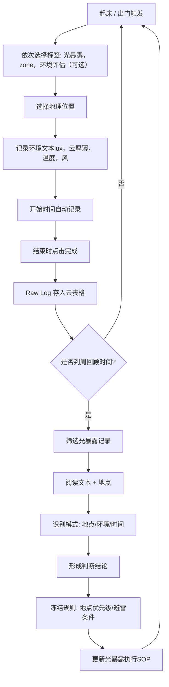

```mermaid

flowchart TD

A[起床 / 出门触发] --> B[依次选择标签: 光暴露，zone，环境评估（可选）]
B --> C[选择地理位置]
C --> D[记录环境文本lux，云厚薄，温度，风]
D --> E[开始时间自动记录]
E --> F[结束时点击完成]
F --> G[Raw Log 存入云表格]

G --> H{是否到周回顾时间?}

H -- 否 --> A
H -- 是 --> I[筛选光暴露记录]

I --> J[阅读文本 + 地点]
J --> K[识别模式: 地点/环境/时间]

K --> L[形成判断结论]
L --> M[冻结规则: 地点优先级/避雷条件]

M --> N[更新光暴露执行SOP]

N --> A

```