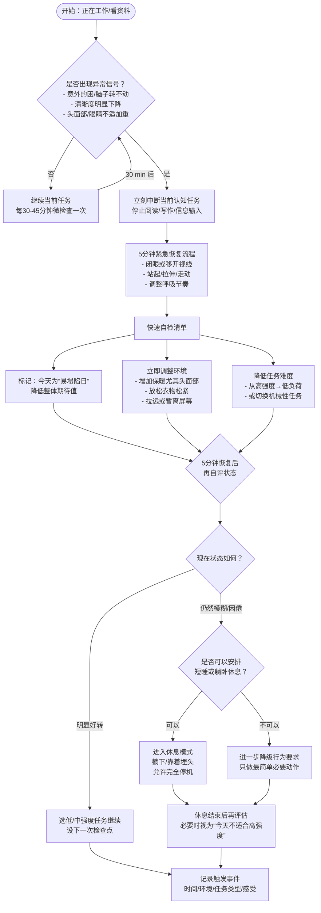

```mermaid
flowchart TD
    A([开始：正在工作/看资料])
    A --> B{是否出现异常信号？<br/>- 意外的困/脑子转不动<br/>- 清晰度明显下降<br/>- 头面部/眼睛不适加重}

    B -- 否 --> C[继续当前任务<br/>每30-45分钟微检查一次]
    C -->|30 min 后| B

    B -- 是 --> D[立刻中断当前认知任务<br/>停止阅读/写作/信息输入]
    D --> E[5分钟紧急恢复流程<br/>- 闭眼或移开视线<br/>- 站起/拉伸/走动<br/>- 调整呼吸节奏]

    E --> F[快速自检清单]
    F --> G[标记：今天为“易塌陷日”<br/>降低整体期待值]
    F --> H[立即调整环境<br/>- 增加保暖尤其头面部<br/>- 放松衣物松紧<br/>- 拉远或暂离屏幕]
    F --> I[降低任务难度<br/>- 从高强度→低负荷<br/>- 或切换机械性任务]

    G --> M{5分钟恢复后<br/>再自评状态}
    H --> M
    I --> M

    M --> N{现在状态如何？}
    N -- 明显好转 --> O[选低/中强度任务继续<br/>设下一次检查点]
    N -- 仍然模糊/困倦 --> P{是否可以安排<br/>短睡或躺卧休息？}

    P -- 可以 --> Q[进入休息模式<br/>躺下/靠着埋头<br/>允许完全停机]
    P -- 不可以 --> R[进一步降级行为要求<br/>只做最简单必要动作]

    Q --> S[休息结束后再评估<br/>必要时视为“今天不适合高强度”]
    R --> S
    O --> T[记录触发事件<br/>时间/环境/任务类型/感受]
    S --> T
```