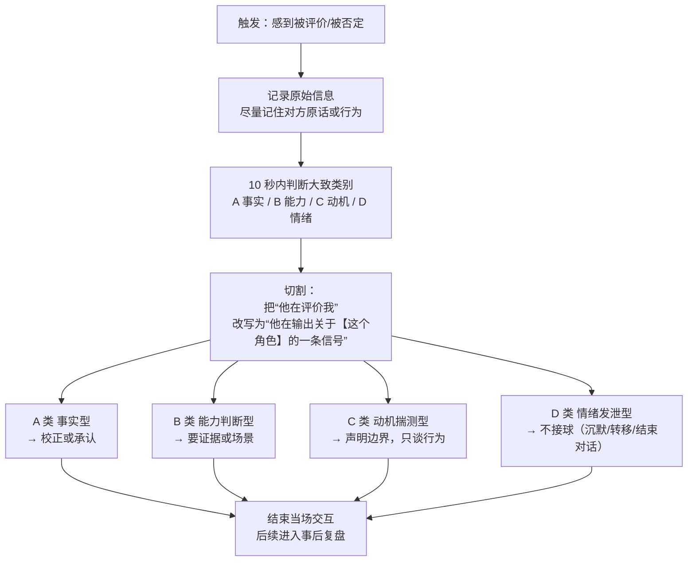

# 人际评价 - 当场处理流程图（mermaid） v1.0

```mermaid
flowchart TD
    T[触发：感到被评价/被否定] --> L[记录原始信息<br/>尽量记住对方原话或行为]
    L --> K[10 秒内判断大致类别<br/>A 事实 / B 能力 / C 动机 / D 情绪]
    K --> S[切割：<br/>把“他在评价我”<br/>改写为“他在输出关于【这个角色】的一条信号”]

    S --> A[A 类 事实型<br/>→ 校正或承认]
    S --> B[B 类 能力判断型<br/>→ 要证据或场景]
    S --> C2[C 类 动机揣测型<br/>→ 声明边界，只谈行为]
    S --> D[D 类 情绪发泄型<br/>→ 不接球（沉默/转移/结束对话）]

    A --> R[结束当场交互<br/>后续进入事后复盘]
    B --> R
    C2 --> R
    D --> R
```

