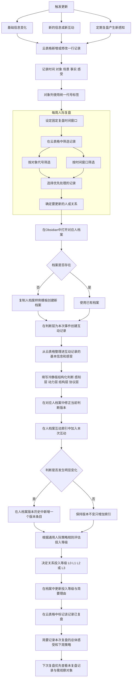

```mermaid
flowchart TD
    T[触发更新] --> T1[基础信息变化]
    T --> T2[新的信息或新互动]
    T --> T3[定期复盘产生新感知]

    T1 --> R1[云表格新增或修改一行记录]
    T2 --> R1
    T3 --> R1

    R1 --> R2[记录时间 对象 场景 事实 感受]
    R2 --> R3[对象列使用统一代号标签]

    subgraph WeeklyReview[每周人际复盘]
        WR1[设定固定复盘时间窗口] --> WR2[在云表格中筛选记录]
        WR2 --> WR2A[按对象代号筛选]
        WR2 --> WR2B[按时间窗口筛选]
        WR2A --> WR3[选择优先处理的记录]
        WR2B --> WR3
        WR3 --> WR4[确定要更新的人或关系]
    end

    R3 --> WeeklyReview

    WR4 --> O1[在Obsidian中打开对应人档案]
    O1 --> O1A{档案是否存在}
    O1A -->|否| O1B[复制人档案样例模板创建新档案]
    O1A -->|是| O1C[使用已有档案]

    O1B --> O2[在判断层为本次事件创建互动记录]
    O1C --> O2

    O2 --> O3[从云表格整理进互动记录的基本信息和感受]
    O3 --> O4[填写冷静版结构化判断 感知层 动力层 结构层 协议层]

    O4 --> U1[在对应人档案中修正当前判断版本]
    U1 --> U2[在人档案互动索引中加入本次互动]
    U2 --> U3{判断是否发生明显变化}
    U3 -->|是| U4[在人档案版本历史中新增一个版本条目]
    U3 -->|否| U5[保持版本不变只增加索引]

    U4 --> S1[根据通用人际策略规则评估投入等级]
    U5 --> S1

    S1 --> S2[决定关系投入等级 L0 L1 L2 或 L3]
    S2 --> S3[在档案中更新投入等级与简要理由]

    S3 --> C1[在云表格中标记该记录已复盘]
    C1 --> C2[简要记录本次复盘的总体感受和下周策略]
    C2 --> C3[下次复盘优先查看未复盘记录与需观察对象]
```

