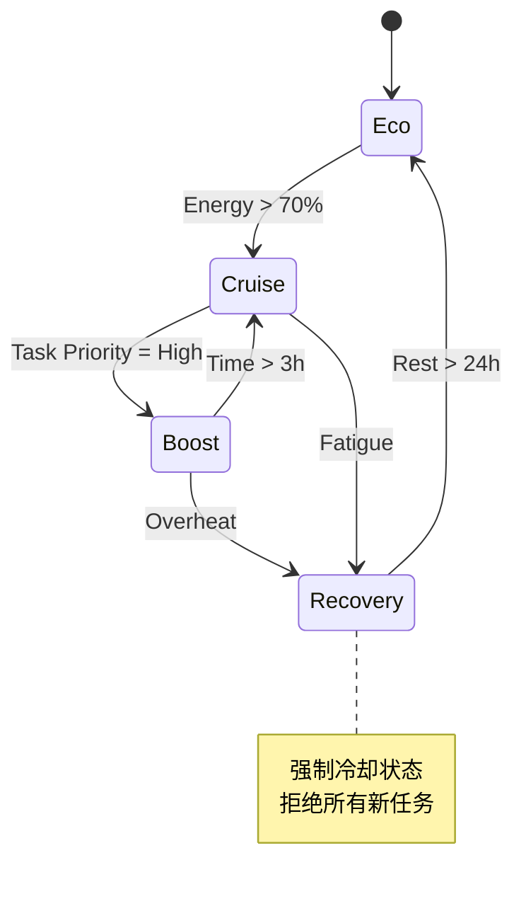

# 模块 2：生物机体规格书 (Bio-System Spec Sheet)

## 1. 第一性原理 (First Principles)
本模块基于**机械工程**与**生物钟学 (Chronobiology)**。
- **公理**：人体不是软件，而是硬件。它有固定的额定功率、散热效率、疲劳极限和维护周期。
- **推论**：任何试图超越硬件物理极限的操作（如“用意志力战胜困意”），本质上是透支硬件寿命（Overclocking with Voltage Increase），必然导致硬件缩肛（Degradation）。

## 2. 硬件规格定义 (Hardware Specifications)

### 2.1 核心组件参数

| 组件 | 参数项 | 规格描述 (Spec) | 测量方法 |
|---|---|---|---|
| **CPU (大脑)** | 算力峰值时段 | 09:00 - 11:30 (Morning Peak) 20:00 - 21:30 (Evening Peak) | 记录过去 30 天高产出任务的时间分布 |
| **CPU (大脑)** | 连续最大负载 | 90 mins (伴随 15 min 冷却) | 记录专注力衰减点 |
| **Battery (精力)** | 充放电循环 | 16h 放电 / 8h 充电 | 睡眠追踪数据 |
| **Cooling (散热)** | 压力耗散率 | 需 60 min 恢复/单位高压事件 | 心率变异性 (HRV) 回升曲线 |
| **I/O (社交)** | 并发连接数 | Max 3 active threads (3人以上即过载) | 社交后疲劳度评分 |

### 2.2 运行模式 (Operating Modes)

| 模式代码 | 模式名称 | 功率设定 | 适用场景 | 持续时长上限 |
|---|---|---|---|---|
| **Mode_Eco** | 节能模式 | 30% | 恢复期、生病、情绪低落 | 无限制 |
| **Mode_Cruise** | 巡航模式 | 60% | 日常重复性工作 | 8小时/日 |
| **Mode_Boost** | 睿频模式 | 90% | 攻克难点、紧急交付 | 3小时/日 (需强制冷却) |
| **Mode_Panic** | 应急模式 | 110% | 生存危机 (Fight or Flight) | < 24小时 (后果严重) |

## 3. 运维手册 (Maintenance Manual)

### 3.1 预防性维护 (Preventive Maintenance)
不等待故障发生，而是按计划进行维护。
- **日度维护**：睡前 1h 停机（无蓝光、无信息流）。
- **周度维护**：每周 1 个完整的“无计划日 (No-Plan Day)”，允许系统空转。
- **月度大修**：每月 1 次短途抽离（换环境），清理系统缓存（焦虑）。

### 3.2 故障恢复 SOP (Recovery SOP)
当监测到指标异常（如 HRV 持续过低）时：
1.  **Stop (停机)**：立即停止所有 `Mode_Boost` 任务。
2.  **Isolate (隔离)**：切断外部输入（断网/请假）。
3.  **Cool Down (冷却)**：执行低功耗动作（睡眠/冥想/发呆）。
4.  **Reboot (重启)**：等待系统自发产生“想做事”的信号，严禁外部强制启动。

## 4. 状态转移图 (State Transition Diagram)

---

## 附：个人宪法层面的理解 (Personal Interpretation)

### 1. 将“我”从驾驶员降级为机械师
过去我总以为我是这具身体的“驾驶员”，可以随意踩油门、急刹车，甚至在引擎冒烟时还想再跑两圈。
结果是 2022-2023 年的全面崩溃。那种“油尽灯枯”的感觉，就是引擎拉缸的物理声音。
现在，我通过这份规格书，正式将自己重新定位为**机械师**。我的任务不是逼这台机器跑得更快，而是根据仪表盘的数据（睡眠、心率、脑雾指数），精准地切换档位。
如果仪表盘显示过热，我就停车散热。这不取决于“我想不想”，而取决于“物理定律允不允许”。

### 2. 对“社交高能耗”的去羞耻化
我一直很困惑，为什么别人社交是充电，我社交是掉血？
在我的 `Runtime` 日志里，我发现了那个后台运行的 `Defense Thread`（防御线程）。为了伪装正常、为了避免被评判，这个线程占用了大量的 CPU 和内存。
承认 `I/O (社交)` 的高能耗属性，意味着我不再强迫自己去“变得外向”。
我接受“每次线下社交后需要 48 小时冷却”这个设定，就像接受我的手机电池老化了一样。这不是性格缺陷，这是硬件特性。

### 3. 尊重 Reboot 的不可控性
SOP 中最难的一步是 `Reboot`。过去我总是在系统刚冷却一点点时，就急着强制启动，结果陷入“启动-崩溃-启动-崩溃”的死循环。
现在我理解了，**启动信号必须来自系统内部自发的冲动，而不是外部的焦虑。**
在那个信号出现之前，我有权停留在 `Mode_Eco`，哪怕全世界都在催我。等待，本身就是一种维护。
