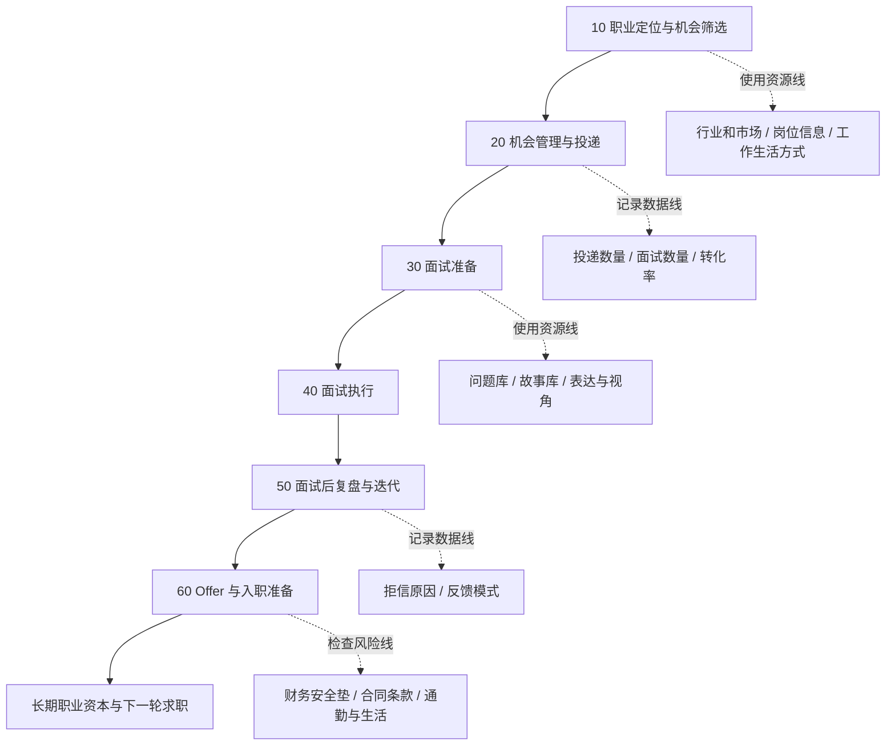

# 求职系统 00 总览 SOP

目标：用一张图把整个求职流程从「决定行动」到「入职前后」串起来，所有其他 SOP 都挂在这张图下面。

每个阶段对应一个独立 SOP 文件：

- 10 职业定位与机会筛选 → 求职系统_10_职业定位与机会筛选_SOP.md
- 20 机会管理与投递 → 求职系统_20_机会管理与投递_SOP.md
- 30 面试准备 → 求职系统_30_面试准备_SOP.md
- 40 面试执行 → 求职系统_40_面试执行_SOP.md
- 50 面试后复盘与迭代 → 求职系统_50_面试后复盘与迭代_SOP.md
- 60 Offer 与入职准备 → 求职系统_60_Offer与入职准备_SOP.md

使用方式：
- 在任何一个求职阶段，只要感觉混乱，就先回到本文件，看自己现在到底在 A10–A60 中的哪一格。
- 然后跳转到对应阶段的独立 SOP 文件，照着其中的步骤执行。

