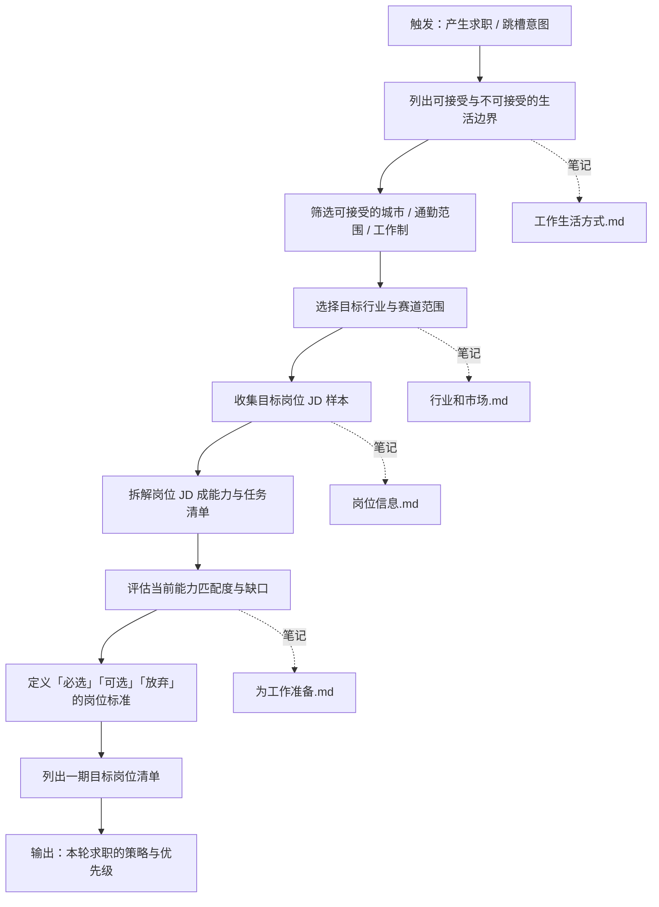

# 求职系统 10 职业定位与机会筛选 SOP

目标：在投简历之前，先把「要不要投」「值得不值得冲」想清楚，避免无效投递和错误选择。

标准操作步骤：

1 明确生活与工作边界
- 更新 工作生活方式.md：写清楚通勤上限、加班容忍度、作息偏好、最低薪资区间。
- 给每一项打标签：强约束 / 弱约束。

2 确定行业与赛道范围
- 在 行业和市场.md 中，按「必进」「可进」「不考虑」列出当前阶段考虑的行业。
- 写下每个行业你愿意选择的理由与顾虑。

3 拆解目标岗位能力模型
- 在 岗位信息.md 中，粘贴或整理多个 JD 的共性部分。
- 把 JD 拆成 3 类：
  - 必须会（核心技能）
  - 最好会（加分项）
  - 可以不会（入职后补）

4 评估自己与岗位的匹配度
- 在 为工作准备.md 中，按「核心技能列表」逐项评估：
  - 当前水平（1–5）
  - 是否有可证明的案例
  - 能否在面试中讲出一个故事。

5 形成筛选标准与目标清单
- 在 岗位信息.md 末尾写一段：
  - 这类岗位，你的「不谈条件也愿意去」标准。
  - 这类岗位，你的「给再多钱也不会去」红线。
- 在 求职记录和感受.md 中新建本轮求职的「目标岗位清单」，只列满足筛选标准的岗位类型。

输出物：
- 更新后的 工作生活方式.md、行业和市场.md、岗位信息.md、为工作准备.md。
- 一份清晰写在笔记里的「本轮求职策略与优先级」。

