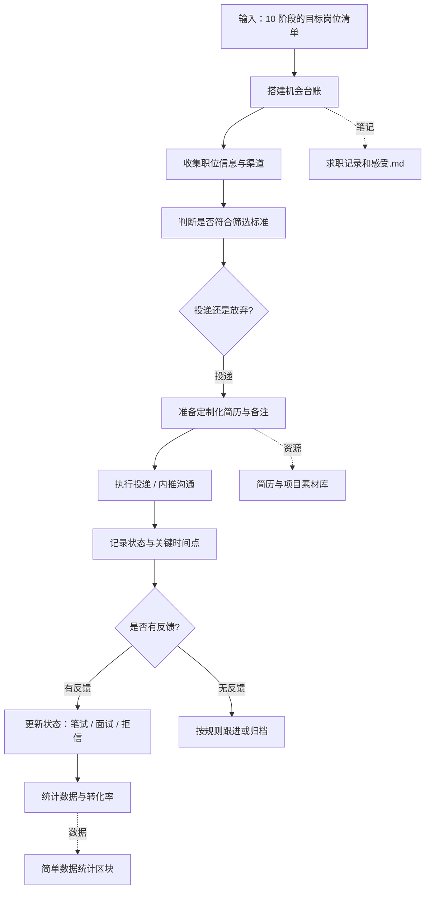

# 求职系统 20 机会管理与投递 SOP

目标：把简历投递和沟通变成一条可统计、可调整的「机会流水线」，而不是随缘投。

标准操作步骤：

1 搭建机会台账
- 在 求职记录和感受.md 中设计一个表格结构，至少包含：
  - 公司名
  - 岗位名称
  - 渠道（直投 / 内推 / 猎头 / 朋友介绍）
  - 投递日期
  - 当前状态（已投递 / 已筛选 / 笔试 / 一面 / 二面 / 已拒 / Offer）
  - 备注（关键人、重点信息）

2 收集和筛选职位
- 每当发现合适岗位：
  - 先对照 10 阶段的筛选标准，判断是否值得投。
  - 不符合硬性边界的直接记在「不投的理由」区域，而不是消失。

3 准备投递材料
- 对每个准备投递的岗位，在备注里写下：
  - 该公司真正看重的 3 点。
  - 你打算用哪 2–3 个经历来对应。
- 简历本身可以放在其他目录，但这里要有「这个岗位用的版本」的说明。

4 记录状态与关键时间点
- 每次状态变化（收到笔试、安排面试、被拒），都立即在 求职记录和感受.md 更新。
- 在备注中同步写下：
  - 对方反馈的关键句。
  - 你对这次互动的直观感受。

5 统计数据与调整策略
- 定期（例如每周一次）在文件末尾增加一个「本周总结」小节：
  - 本周投递数量、获得面试数量、Offer 数量。
  - 按行业或岗位类型粗略统计转化率。
  - 根据数据调整：继续加大 / 暂停 / 调整方向。

输出物：
- 一个持续更新的 求职记录和感受.md，既记录状态，也沉淀模式。
- 对于每个岗位，你一眼能看出：为什么投、进展如何、要不要继续投入时间。

