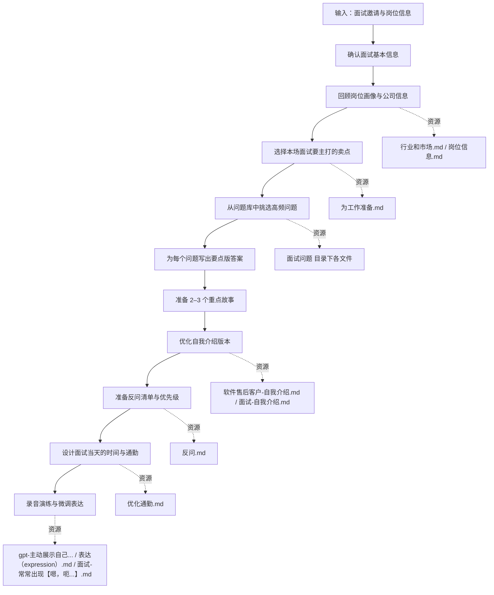

# 求职系统 30 面试准备 SOP

目标：从收到面试邀请到进入会议室，把所有可控的准备动作标准化，降低临场发挥的压力。

标准操作步骤：

1 确认面试基本信息
- 在 wjmber-面试.md 中为本次面试新建一条记录，写明：
  - 公司、岗位、面试轮次、形式（线上 / 线下）、时间。
  - 面试官身份（技术 / 业务 / HR，如已知）。

2 回顾岗位与公司信息
- 快速浏览 岗位信息.md 与 行业和市场.md，更新你对这家公司的判断：
  - 他们需要解决什么业务问题？
  - 这个岗位在团队中的位置是什么？

3 决定本场要主打的卖点
- 在 为工作准备.md 中，挑出与该岗位最匹配的 3 个卖点。
- 写到 wjmber-面试.md 的本次记录里，作为「本场主打」。

4 从问题库挑选高频问题
- 根据岗位类型，在以下文件中挑选本场最可能出现的问题：
  - 你最近学了什么新技能？.md
  - 客户服务经验.md
  - 面试-2. 稳定性问题（你会不会很快离职？）.md
  - 面试-3. 团队融入（你能和大家好好合作吗？）.md
  - 如果你同时负责多个项目，你会如何分配时间和资源？.md
  - 软件售后客户-面试问题.md
  - 面试-可能的问题.md

5 写要点版答案与故事
- 对每个选中的问题，在对应的文件末尾增加「本场面试版本」小节：
  - 用 3–5 个 bullet 写出回答要点。
  - 标注要使用的具体故事（来自你的项目或经历）。

6 优化自我介绍与反问
- 在 软件售后客户-自我介绍.md 或 面试-自我介绍.md 中，为本场面试新建一个版本。
- 在 反问.md 中勾选适合本公司、本轮次的 2–3 个问题，写在 wjmber-面试.md 本次记录里。

7 通勤与时间设计
- 根据面试地点或形式，在 优化通勤.md 中规划：
  - 出发时间与路线。
  - 预留的缓冲时间。
  - 面试前 30 分钟要做的事（复习要点 / 调整状态）。

8 录音演练与表达微调
- 选自我介绍和 2–3 个核心问题，用手机录音，按以下文件的提醒优化：
  - gpt-主动展示自己-如何进一步提升面试交流的质量.md
  - 表达（expression）.md
  - 面试-常常出现【嗯，呃，呵（吸气 砸嘴】等词.md

输出物：
- wjmber-面试.md 中一条完整的「本场面试准备记录」。
- 对应问题文件中新增的「本场版本」答案要点。
- 一份你能顺畅讲出来的自我介绍与 2–3 个核心故事。

