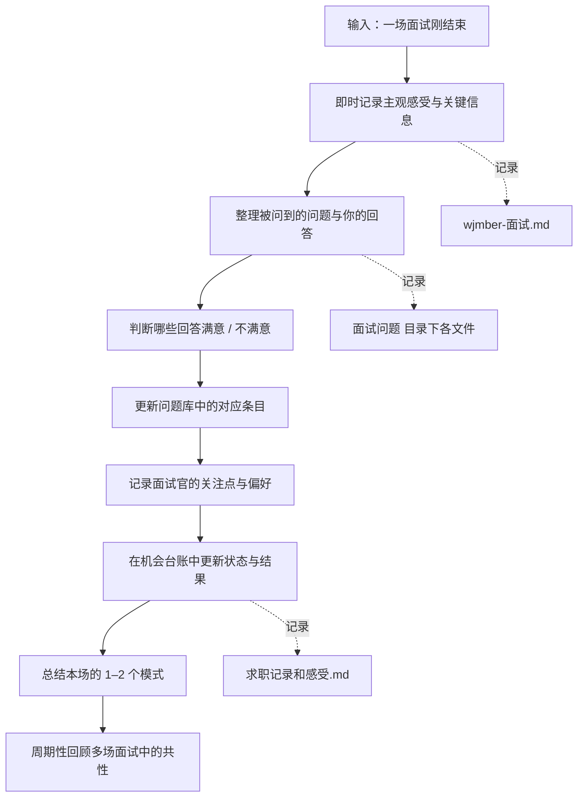

# 求职系统 50 面试后复盘与迭代 SOP

目标：把每一次面试都变成「下次更好」的素材，而不是只留下情绪。

标准操作步骤：

1 即时记录主观感受
- 在 wjmber-面试.md 中找到本场面试的记录，追加：
  - 你走出面试现场时的第一印象。
  - 你觉得自己表现最好 / 最差的 1–2 个瞬间。

2 整理问题与回答
- 尽量在当天，把记得的问题按类别归到对应文件中：
  - 行为面问题 → 对应的行为面笔记（例如 客户服务经验.md）。
  - 稳定性 / 团队 / 多项目等 → 各自的文件。
  - 与岗位高度相关的专业问题 → 软件售后客户-面试问题.md 等。
- 在每个文件里，为本场新增一个简短小节：
  - 被问到的具体问题。
  - 你当时是怎么答的（要点版即可）。

3 标记满意度与改进点
- 对每个关键问题，用「满意 / 一般 / 不满意」简单标注。
- 对不满意的回答，写出下次要调整的 1–2 个关键点。

4 记录面试官的关注点
- 在 wjmber-面试.md 中，本场记录下：
  - 面试官追问最多的方向。
  - 他们对你哪些点反应最好。
  - 有没有暴露出你之前没意识到的短板。

5 更新机会台账
- 在 求职记录和感受.md 中，更新本公司的：
  - 当前状态（例如：一面完成，等通知）。
  - 主观感受（愿意程度、疑虑）。
  - 如收到拒信或反馈，记录对方给出的理由原句。

6 周期性模式总结
- 每完成若干场面试（例如 3–5 场），在 wjmber-面试.md 末尾新增一个「阶段性总结」：
  - 哪些问题高频出现。
  - 哪些回答已经比较成熟，可以视为稳定版本。
  - 哪些方面多次暴露短板，需要回到 10 或 30 阶段调整策略。

输出物：
- wjmber-面试.md 中不断增加的「本场复盘」与「阶段性总结」。
- 各问题文件中越来越贴近真实场景的答案版本。
- 求职记录和感受.md 中更客观的数据与决策依据。

