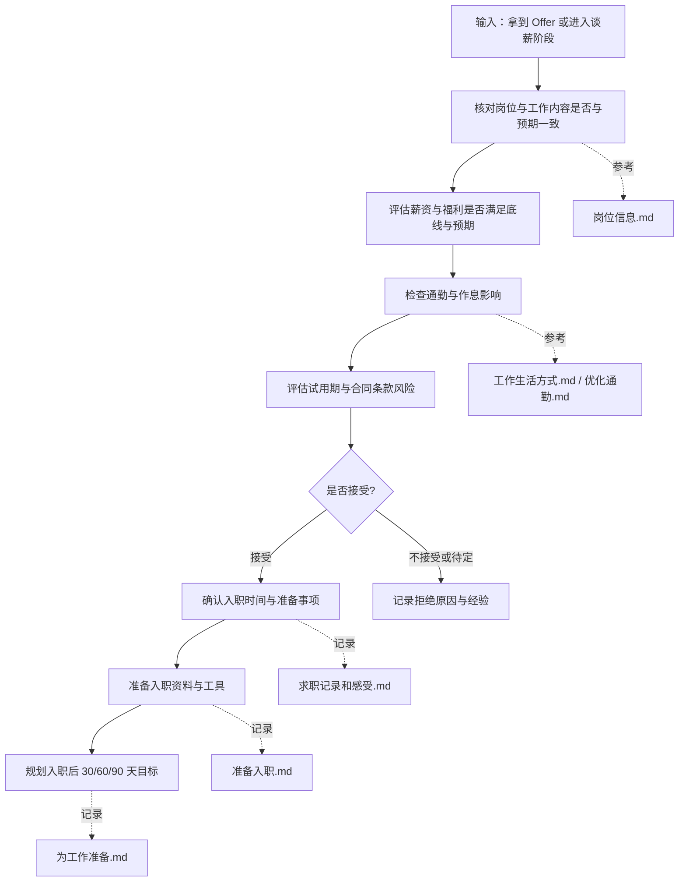

# 求职系统 60 Offer 与入职准备 SOP

目标：在收到结果后，从容处理 Offer、风险与生活安排，让「上岸」变成下一阶段的起点。

标准操作步骤：

1 校验岗位与工作内容
- 对照 岗位信息.md 中你当时理解的岗位画像：
  - 确认实际工作内容是否发生明显偏移。
  - 如果偏移，判断是可接受的范围，还是触碰了你的红线。

2 评估薪资与福利
- 与 10 阶段中记录的「最低可接受水平」和「目标水平」做对比。
- 不只看税前数字，还要关注：
  - 年终、绩效占比。
  - 加班费 / 调休规则。
  - 其他福利（补贴、保险等）。

3 检查通勤与作息影响
- 使用 优化通勤.md：
  - 计算上班与下班时间段的真实通勤耗时。
  - 模拟一周的作息，评估对身体与生活的影响。
- 与 工作生活方式.md 中的边界做对比，看是否长期可承受。

4 评估试用期与合同条款风险
- 对照合同中的关键条款：
  - 试用期时长与考核标准。
  - 竞业限制条款。
  - 加班、调休、请假规则。
- 如有必要，单独记一条「Offer 校验清单」，逐项打勾。

5 做出接受 / 拒绝 / 待定决策
- 在 求职记录和感受.md 中更新状态：
  - 接受：记录入职时间与主要谈定的条件。
  - 拒绝：记录拒绝原因（包括你自己的判断和对方的态度）。
  - 待定：写明要进一步确认的具体问题和期限。

6 准备入职
- 在 准备入职.md 中整理清单：
  - 证件与资料（身份证、银行卡、学历证书等）。
  - 设备与软件准备。
  - 入职前建议阅读的资料（公司产品、文档等）。

7 规划入职后 30/60/90 天
- 在 为工作准备.md 中，为新岗位写下：
  - 30 天：熟悉环境与基础任务。
  - 60 天：能独立承担关键任务。
  - 90 天：能交付一个可见的成果或优化。

输出物：
- 求职记录和感受.md 中清晰的 Offer 决策记录。
- 准备入职.md 中可直接勾选的入职清单。
- 为工作准备.md 中一个与你新岗位匹配的 30/60/90 天计划。

