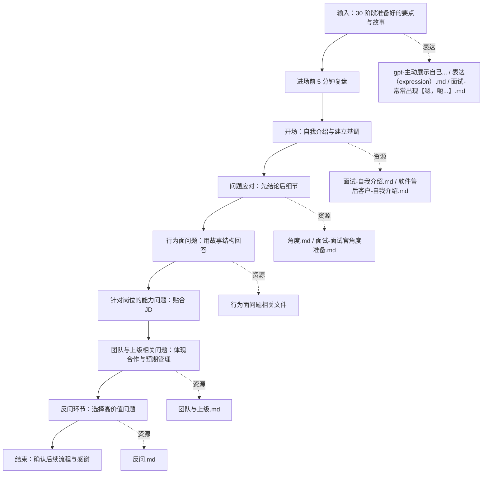

# 求职系统 40 面试执行 SOP

目标：在面试现场保持稳定、清晰、对齐业务需求的表现，而不是被问题牵着走。

标准操作步骤：

1 进场前 5 分钟
- 在脑中快速扫描：
  - 本场的 3 个主打卖点。
  - 2–3 个准备好的关键故事。
  - 反问环节要问的 2–3 个问题。

2 开场与自我介绍
- 使用 面试-自我介绍.md 或 软件售后客户-自我介绍.md 中为本场准备的版本。
- 注意三个点：
  - 第一句话给出你最核心的身份与价值。
  - 按时间线简要串联关键经历。
  - 用一两句话对齐岗位需求（说明你为什么适合这份工作）。

3 回答问题的一般原则
- 先给结论，再补充背景与例子。
- 每当被问「你怎么看」「你怎么做」，尽量用固定结构：
  - 情境
  - 你的判断
  - 你的行动
  - 结果与反思

4 行为面与故事型问题
- 面对诸如「最近学了什么新技能」「客户服务经验」「团队冲突」等问题：
  - 使用对应问题文件中事先准备好的「本场版本」要点。
  - 按 STAR 或类似结构讲清楚：情境、任务、行动、结果。

5 团队与上级相关问题
- 面对诸如「能否融入团队」「和上级意见不合怎么办」等问题：
  - 参考 团队与上级.md 中的表达框架。
  - 在尊重团队和上级的前提下表达你对沟通、反馈和预期管理的看法。

6 反问环节
- 使用 反问.md 中事先勾选好的问题：
  - 先问与你未来实际工作最相关的。
  - 再考虑团队氛围、成长空间、协作方式等问题。
  - 避免一开始就问待遇与休假细节，把这些留到更合适的时机。

7 语言与表现细节
- 参考：
  - gpt-主动展示自己-如何进一步提升面试交流的质量.md
  - 表达（expression）.md
  - 面试-常常出现【嗯，呃，呵（吸气 砸嘴】等词.md
- 在现场刻意做到：
  - 放慢语速，允许短暂停顿，不用「嗯、啊」填充。
  - 用「我观察到」「我理解为」等句式展示思考过程。
  - 适度表达你的思考与不确定，避免绝对化表达。

输出物：
- 面试结束后，你可以在 wjmber-面试.md 中更容易回忆起现场表现，因为你是按固定结构输出的。

