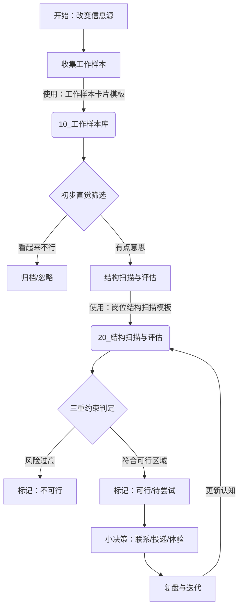

# 雇佣评估系统 SOP

**版本**：v1.0  
**目标**：在生存预算约束下，建立一套标准化的“信息输入-评估-决策”系统，避免情绪化决策。

## 1. 文件夹架构说明

- **`00_架构与SOP`**：本文件及系统设计文档。
- **`10_工作样本库`**：原始数据池。每看到一个潜在岗位，建立一个独立文档。
- **`20_结构扫描与评估`**：对经过初步筛选的岗位，进行深度结构扫描的文档。
- **`99_模板`**：存放各类评估模板，复制使用。

## 2. 评估流程 (SOP)

## 3. 标签系统 (Tagging)

在 Obsidian 中使用以下标签对文档进行管理：

**阶段标签**：
- `#阶段/样本收集`
- `#阶段/深度评估`
- `#阶段/已决策`

**结论标签**：
- `#可行性/高`：符合生存+精神+自尊约束。
- `#可行性/中`：有风险但可控，适合过渡。
- `#可行性/低`：明显推离可行区域（如送货/高压销售）。
- `#风险/身体负荷`
- `#风险/精神噪音`
- `#风险/收入不稳`

## 4. 关键动作说明

### 4.1 样本收集
- **动作**：浏览招聘/社交平台。
- **产出**：在 `10_工作样本库` 中新建笔记，填入基础信息（工资、工时、直觉）。
- **心态**：只收集，不评判，不焦虑。

### 4.2 结构扫描
- **动作**：对入围样本进行“解剖”。
- **产出**：在 `20_结构扫描与评估` 中新建笔记，详细分析节奏、环境、掉线空间。
- **核心**：诚实面对自己的“生存预算评估模块”。

### 4.3 小决策与复盘
- **动作**：打上标签，写下一句结论。
- **复盘**：如果实际体验了，回来更新评估文档的“复盘区”。

## 5. 面向协作 AI 的追加 Skill：上游公理推导

为了让阅读本仓库的任意 AI 助手在面对“大方向/大赛道”问题时有一致做法，增加如下 Skill：

### Skill 4：使用工作-公司-社会公理进行上游剪枝

- 触发条件：
  - 用户的问题还停留在“大方向/大赛道/行业/岗位族群”，尚未具体到某个 JD 或单一岗位；
  - 用户提到能量有限、无法承受大量试错，明确希望“先用推理做搜索空间剪枝”；
  - 示例：对“制造业大生产”“自媒体行业”“客服外包”等整体产生好奇。

- 行为规范：
  1. 阅读并引用以下文件：
     - `00_架构与SOP/工作-公司-社会_公理与推导基底_v0.1.md`
     - `00_架构与SOP/工作-公司-社会_AI推导SOP_v0.1.md`
     - `3_Domains/财富/2_个人资源与约束/个人约束.md`
  2. 按《工作-公司-社会_AI推导SOP_v0.1.md》中给出的 6 步流程和 Mermaid 流程图：
     - 识别问题层级（行业/公司/岗位）；
     - 抽取相关宏观/中观/微观公理；
     - 结合个人约束进行结构化推导；
     - 给出赛道级的剪枝结论与可保留的异步/弱实时子方向；
     - 决定是否需要在 `10_工作样本库` 和 `20_结构扫描与评估` 中新建“方向级”文档。
  3. 回答时，需要明确区分：
     - “基于公理的概率性推断”（可用于剪枝）；
     - “需要未来实践验证的部分”（不强行装作确定）。

- 输出：
  - 一段结构化的文字结论，说明：
    - 该大方向在当前阶段对用户的整体可行性（高/中/低）；
    - 建议整体剪掉的高危生态位类型（如强实时救火岗位、持续高噪音一线岗位等）；
    - 建议保留为后续样本/扫描来源的子方向（通常是弱实时或近异步位置）。
  - 如该大方向在后续可能反复出现，建议创建：
    - 一份“方向级工作样本卡片”（放入 `10_工作样本库`）；
    - 必要时创建对应的“方向级结构扫描”文档（放入 `20_结构扫描与评估`），并打上可行性标签。
