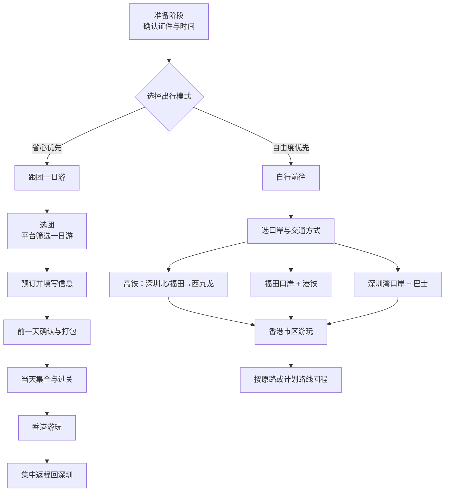

深圳→香港 出行SOP（个人 / 跟团通用）
=================================

使用方式：直接照步骤执行，不需要额外思考。每次出发前只要从「前一天」开始往后按清单勾就行。

可视化总流程图（在 Obsidian 中查看）
------------------------------

一、前提与总体原则
----------------
- 证件：身份证 + 港澳通行证（含有效赴港签注，确认在有效期内且次数足够）
- 通关口岸：优先选「福田口岸」或「深圳湾口岸」，尽量避开节假日高峰早晚高峰
- 目标：安全、省心、性价比高，宁可少去一两个景点，也不要把自己搞得很累
- 决策顺序：先选出行模式（跟团 / 自行），再选口岸与交通，最后安排简易行程

二、先做一个快速选择
------------------

你只需要回答三个问题：

1. 这是你第一次去香港或者很久没去吗？
2. 你这次更在意「省心」还是「自由度」？
3. 你可以接受在手机上自己查交通、看地图吗？

按下面决策：
- 更想省心，不想查路线、不想自己看地图 → 选「跟团一日游」
- 想自由一些、行程自己定，可以接受查地铁 → 选「自行前往」

如果完全犹豫不决：第一次建议选「跟团一日游」，熟悉流程之后下次再自由行。

三、跟团方案 SOP（省心优先）
-------------------------

适用：第一次去香港、只想走马观花看几个点、希望有人带着走，不想费脑子。

步骤 1：选团（前 3–7 天）
- 打开任一平台：携程 / 飞猪 / 马蜂窝 / 本地旅行社公众号
- 搜索关键词：「深圳 香港 一日游」
- 过滤条件：
  - 出发地：深圳
  - 是否含餐：优先「含 1 顿午餐」或「不含餐」但说明清楚
  - 是否强制购物：尽量选「无强制购物」或购物较少且评价好
- 只看评价：评分 ≥ 4.6 且有近 3 个月真实评价的产品
- 确认以下信息写得清楚：
  - 集合时间、集合地点（一般是某个地铁站 / 口岸附近）
  - 过关方式（团队过关 / 个人过关），是否需要提前提供证件信息
  - 是否包含香港当地交通、景点门票
  - 回程时间和地点（是否原路返回深圳）

步骤 2：预订
- 按平台流程下单，选择你想去的日期
- 按要求上传或填写：
  - 姓名（与证件一致）
  - 身份证号码
  - 港澳通行证号码及签注信息（如平台需要）
- 备注：
  - 如有饮食忌口（不吃辣、不吃海鲜等）可在备注说明
  - 如你有晕车，备注中提前写出
- 保留：
  - 订单截图、客服联系方式、集合地点地图

步骤 3：前一天准备
- 打开订单，再次确认：
  - 集合时间（精确到几点几分）
  - 集合地点（地铁几号线、几号口）
  - 领队联系电话 / 微信
- 打包必需品：
  - 证件：身份证 + 港澳通行证
  - 现金：建议准备 200–500 港币，或确认支付宝 / 微信可以在香港使用
  - 手机与充电宝
  - 雨伞、防晒（香港日照强）
  - 一次性口罩（如个人习惯）
- 在领队微信群（或平台消息）里确认：
  - 集合时间是否有变化
  - 领队是否有额外提醒（穿着、注意事项）

步骤 4：出行当日
- 提前 10–20 分钟到达集合点
- 跟随领队指示完成：
  - 深圳边检出境
  - 香港入境检查
- 在车上或行走过程中，注意：
  - 听清集合时间和地点
  - 拍照记录每次集合地点附近的明显标志物
- 消费时：
  - 如果去购物点，只买自己确定需要的东西
  - 对高价保健品、名贵表、珠宝保持克制

步骤 5：返程
- 按领队安排，通常是：
  - 晚上 7–9 点左右集中
  - 统一返回口岸，再从口岸回深圳
- 回到深圳后：
  - 确认可顺利回到地铁站或打车点
  - 回家后整理这次经验，下次可以尝试自由行

四、自行前往方案 SOP（自由度优先）
-----------------------------

适用：不怕自己查路线，想多在香港闲逛，不一定要看所有景点。

整体结构：
- 先选口岸 → 再选交通工具 → 确定落脚区（例如尖沙咀 / 中环）

1. 口岸选择
- 住在福田、南山一带：首选「福田口岸」或「深圳湾口岸」
- 住在罗湖一带：可选「罗湖口岸」
- 想最省事、只去市中心：考虑「高铁 深圳北 / 福田 → 香港西九龙」

推荐优先级（从省事到折中）：
- 方案 A：高铁直达（深圳北 / 福田 → 西九龙）
- 方案 B：福田口岸 + 港铁
- 方案 C：深圳湾口岸 + 巴士 + 港铁

2. 方案 A：高铁 深圳 → 香港西九龙（最直观）

步骤 A1：买票（提前 1–3 天）
- 使用 12306 官方 App
- 查询：出发地「深圳北」或「福田」，目的地「香港西九龙」
- 选择合适时间车次，下单购票
- 确保姓名、身份证信息无误

步骤 A2：出发前准备（当日）
- 提前 60–90 分钟到达车站（深圳北或福田）
- 按站内指示前往「出境 / 香港方向」候车区
- 准备好：
  - 身份证
  - 港澳通行证
  - 车票（电子即可，手机电量要足够）

步骤 A3：通关与乘车
- 在车站完成：
  - 内地边检出境（刷证件）
  - 香港入境预检（可能在到达香港后办理）
- 上车后根据车票找到座位，保管好证件与贵重物品

步骤 A4：到达西九龙后
- 按指示牌完成入境检查（香港边检）
- 入境后，按指示前往「九龙站 / 港铁站」
- 办理香港交通卡：
  - 八达通卡（现场购卡 / 充值）
  - 或确认手机上的支付宝 / 微信拥有「港铁乘车码」并可使用
- 乘港铁前往你想去的区域：
  - 尖沙咀：在柯士甸 / 尖沙咀站下车，步行即可
  - 中环 / 金钟：乘港铁到金钟 / 中环站

3. 方案 B：福田口岸 + 港铁

步骤 B1：到达福田口岸
- 在深圳地铁中：
  - 乘坐地铁到「福田口岸站」
  - 出站后按指示前往出境大厅

步骤 B2：通关
- 深圳边检出境：按队伍排队，刷身份证 + 港澳通行证
- 穿过桥后，到达香港入境检查：
  - 按工作人员指示排队
  - 出示港澳通行证及入境所需信息

步骤 B3：乘港铁
- 通关后你会到达「落马洲站」或相关港铁站
- 使用八达通卡或扫码进站
- 乘坐东铁线：
  - 目标方向：金钟站
  - 如需去尖沙咀：到金钟站换乘荃湾线，在尖沙咀站下车
  - 如需去中环：在中环站下车或金钟步行过去

4. 方案 C：深圳湾口岸 + 巴士

步骤 C1：到达深圳湾口岸
- 从深圳乘公交 / 网约车到「深圳湾口岸」

步骤 C2：通关
- 先在内地一侧完成出境
- 通过中间通道，到香港一侧完成入境

步骤 C3：乘巴士进入市区
- 按指示乘坐香港方向巴士（如 B 系列线路）
- 在荃湾 / 深水埗等地落车后换乘港铁到市区

五、香港一日基础行程模板
----------------------

如果你不想设计行程，可以直接用下面模板：

上午：
- 8:00–10:00 深圳出发，过关（福田口岸 / 高铁）
- 10:00–11:00 抵达尖沙咀 / 中环，简单逛街或维港海边走一圈

中午：
- 11:30–13:00 找一间茶餐厅或酒楼吃午饭（点心 / 烧腊）

下午：
- 13:30–16:30 按兴趣二选一：
  - 维港周边：海港城、星光大道
  - 太平山顶：从中环天星码头附近坐山顶缆车或巴士

傍晚：
- 17:00–19:00 在尖沙咀 / 中环随意逛街，适度购物

晚上：
- 19:30–20:30 维港看夜景（尖沙咀海滨长廊）
- 20:30–22:00 按原路返回西九龙 / 口岸，回深圳

六、支付与网络 SOP
----------------

支付：
- 优先准备：
  - 手机：确认支付宝 / 微信已开通境外支付（可提前在 App 内查看「境外服务」）
  - 现金：建议备少量港币（200–500），用于小店或地摊
- 消费习惯：
  - 正常餐饮、购物可用支付宝 / 微信 / 银联卡
  - 少用信用卡透支消费，避免行程后产生压力

网络：
- 方案 1：开通手机漫游日包（最简单）
- 方案 2：提前在淘宝 / 平台购买香港 eSIM 或电话卡，到香港后按指引激活
- 方案 3：部分公共场所有免费 Wi-Fi，但不稳定，不建议完全依赖

七、回程 SOP
-----------

回程原则：
- 预留足够时间：至少提前 1.5–2 小时从香港市区出发往口岸
- 尽量避免末班车 / 末班船，给自己留出缓冲

步骤：
- Step 1：查看当日回程口岸开放时间及交通末班时间（手机地图搜索）
- Step 2：按「来时路线」反向返回：
  - 西九龙：乘港铁回西九龙站 → 出境 → 乘高铁回深圳
  - 福田口岸：乘港铁到落马洲站 → 过关 → 深圳地铁回家
  - 深圳湾口岸：乘巴士回口岸 → 过关 → 网约车 / 公交回家
- Step 3：回到深圳后，确认：
  - 证件是否全部带回
  - 贵重物品是否齐全

八、极简执行清单（你只需要看这一段）
------------------------------

前 3–7 天：
- 确认港澳通行证 + 签注有效
- 在平台上：
  - 想省心 → 搜「深圳 香港 一日游」报团
  - 想自由 → 在 12306 买「深圳北 / 福田 → 香港西九龙」高铁票

前一天：
- 再次确认集合时间 / 车次时间
- 打包：身份证、港澳通行证、现金、充电宝、伞、防晒
- 确认手机有网络方案（漫游 / eSIM）

当天出发：
- 提前 60–90 分钟到达集合点 / 车站 / 口岸
- 按指示完成出境 + 入境
- 到香港后：
  - 办理八达通或确认手机可以刷码坐车
  - 用「一日行程模板」逛一天

当天回程：
- 提前 1.5–2 小时从香港市区往回走
- 过关回深圳，地铁 / 网约车回家

下次再去：
- 如果第一次是跟团，下次就按「高铁 + 自行」方案走一遍
- 把这份 SOP 存在你的笔记里，每次照着执行即可
