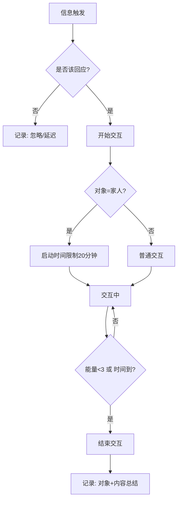

```mermaid
flowchart TD
    A[信息触发] --> B{是否该回应?}

    B -- 否 --> X[记录: 忽略/延迟]
    B -- 是 --> C[开始交互]

    C --> D{对象=家人?}

    D -- 是 --> E[启动时间限制20分钟]
    D -- 否 --> F[普通交互]

    E --> G[交互中]
    F --> G[交互中]

    G --> H{能量<3 或 时间到?}

    H -- 是 --> I[结束交互]
    H -- 否 --> G

    I --> J[记录: 对象+内容总结]

```