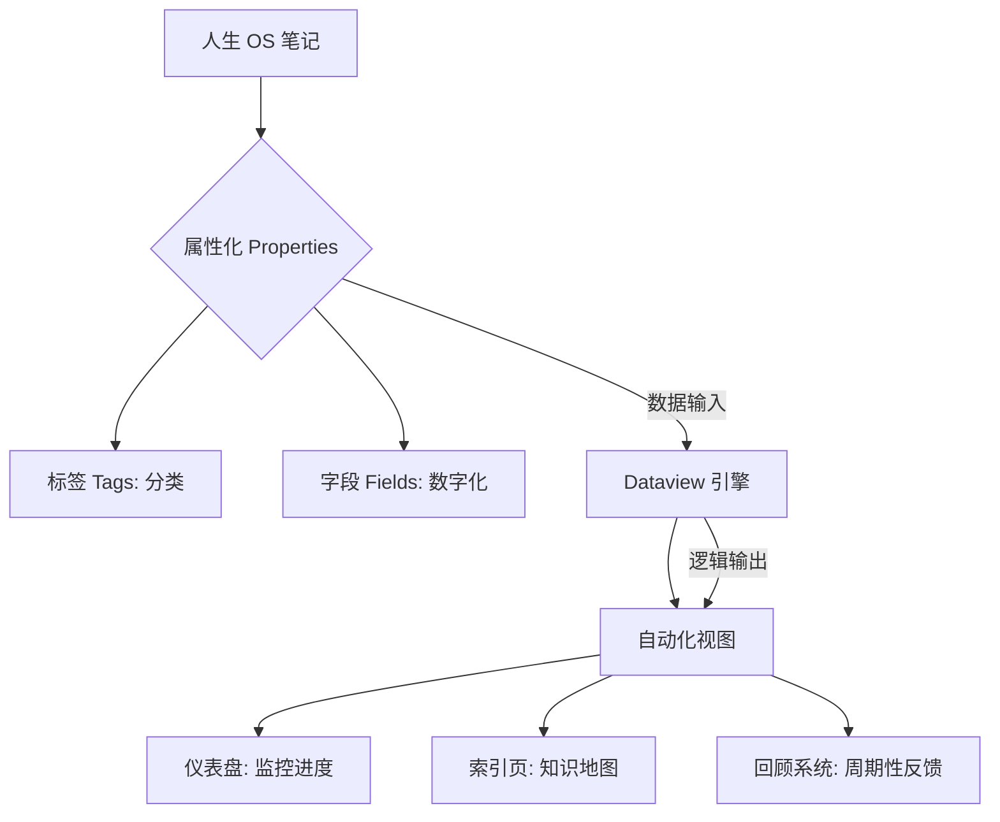

```mermaid
graph TD
    A[人生 OS 笔记] --> B{属性化 Properties}
    B --> B1[标签 Tags: 分类]
    B --> B2[字段 Fields: 数字化]
    
    C[Dataview 引擎] --> D[自动化视图]
    D --> D1[仪表盘: 监控进度]
    D --> D2[索引页: 知识地图]
    D --> D3[回顾系统: 周期性反馈]
    
    B --数据输入--> C
    C --逻辑输出--> D
```

#mermaid
