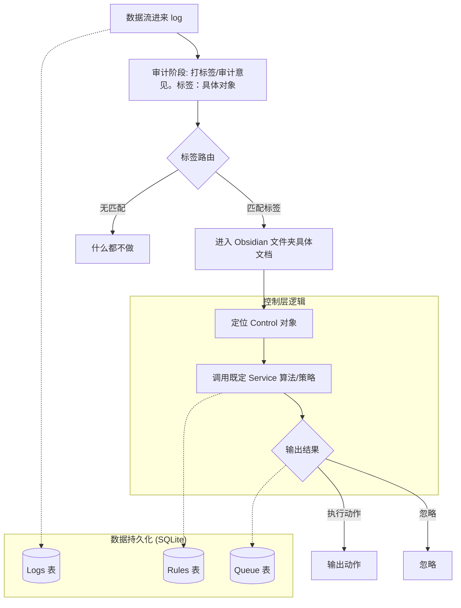

# 人生OS 1.0 系统流程图

以下是基于 [os1.0 sop.md](file:///d:/%E4%B8%AA%E4%BA%BA%E8%AE%B0%E5%BD%95/obsidian-file/wjmber/tasks/%E9%9C%80%E6%B1%82/LifeOS/0_Inbox/os1.0%20sop.md) 描述的系统逻辑流程图。

## 流程说明

1.  **输入层 (Log)**: 记录原始文本数据。
2.  **路由层 (Audit/Routing)**: 通过标签（如 `健康-补剂-肌酸`）将数据路由到对应的领域。
3.  **控制层 (Control)**: 核心判断逻辑，根据标签匹配 Control 对象。如果没有匹配的 Control，则不执行任何操作。
4.  **服务层 (Service)**: 执行具体的算法或策略。
5.  **动作层 (Action)**: 输出最终动作或选择忽略。
