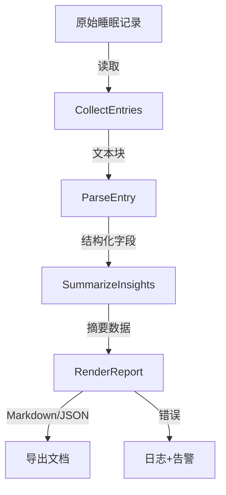

## Product Overview

- 汇总 `LifeOS/3_Domains/Health/睡眠-非结构dao` 目录下 11 篇睡眠记录，统一提炼背景、症状、触发因素与应对策略，形成可阅读的结构化摘要文档，包含时间线概览与字段化卡片展示。

## Core Features

- 记录采集：自动收集目录内全部睡眠记录，并以时间顺序列出，提供简洁列表展示效果。
- 维度提炼：针对每篇记录抽取背景、症状、触发因素、策略与备忘，输出表格化或卡片式结构，强调对比清晰。
- 趋势总结：基于全部记录输出跨记录洞察（高频症状、共通触发、有效策略），以章节化描述结合可视化要点（如项目符号、高亮）呈现。

## Tech Stack

- 数据处理：Python 3 脚本（pandas、regex、自定义解析器）
- 服务层：FastAPI 轻量接口，便于触发批处理与复用
- 存储：本地文件系统输入，生成 Markdown/JSON 导出
- 工具：UnitTest/pytest 用于关键逻辑校验

## Tech Architecture

系统采用分层架构：采集层负责文件遍历与原文读取，解析层进行字段抽取与清洗，洞察层聚合统计并生成报告，输出层负责 Markdown/JSON 渲染与导出。


## Module Division

- **采集模块**：遍历目录、过滤文件、读取文本；依赖文件系统；接口 `collectEntries()`.
- **解析模块**：正则/模板解析背景、症状、触发因素、策略；依赖采集模块；接口 `parseEntry(rawEntry)`.
- **洞察模块**：统计高频模式、生成跨记录结论；依赖解析模块；接口 `summarizeInsights(entries)`.
- **输出模块**：渲染 Markdown/JSON、生成章节/卡片布局；依赖解析与洞察模块；接口 `renderReport(structuredData)`.

## Data Flow



## Implementation Details

### Core Directory Structure

```
sleep-report/
├── data/                     # 原始记录存放
├── src/
│   ├── collectors/
│   │   └── fileCollector.py
│   ├── parsers/
│   │   └── sleepParser.py
│   ├── analyzers/
│   │   └── insightEngine.py
│   ├── reporters/
│   │   └── markdownRenderer.py
│   ├── api/
│   │   └── main.py
│   └── tests/
│       └── test_sleep_parser.py
└── requirements.txt
```

### Key Code Structures

```python
from dataclasses import dataclass
from typing import List, Dict

@dataclass
class SleepEntry:
    title: str
    date: str
    background: str
    symptoms: List[str]
    triggers: List[str]
    strategies: List[str]
    notes: str

@dataclass
class InsightSummary:
    frequent_symptoms: Dict[str, int]
    common_triggers: Dict[str, int]
    effective_strategies: Dict[str, int]
    recommendations: List[str]

def collect_entries(path: str) -> List[str]: ...
def parse_entry(raw_text: str) -> SleepEntry: ...
def summarize_insights(entries: List[SleepEntry]) -> InsightSummary: ...
def render_markdown(entries: List[SleepEntry], insights: InsightSummary) -> str: ...
```

### Technical Implementation Plan

1. **文件采集与过滤**

- 问题：需准确读取目录中 11 篇记录并保持顺序
- 方案：使用递归遍历与命名排序，过滤非 Markdown
- 技术：os/pathlib, glob
- 步骤：定位目录→列出文件→排序→读取→日志记录
- 测试：伪目录数据驱动测试校验数量与排序

2. **字段解析与结构化**

- 问题：原记录为非结构化文本
- 方案：正则+关键字分段，缺失项默认空
- 技术：regex、pydantic 数据校验
- 步骤：定义模式→解析段落→映射至 SleepEntry→校验→写单测
- 测试：多样化样本文本确保字段覆盖

3. **洞察总结与报告输出**

- 问题：需统计高频模式并以 Markdown 呈现
- 方案：collections.Counter 聚合，高亮关键条目
- 技术：Counter、Jinja2 模板
- 步骤：聚合统计→生成 InsightSummary→渲染模板→输出文件
- 测试：检查统计准确性与渲染格式

### Integration Points

- 数据输入：本地文件系统 Markdown 文档
- 输出格式：Markdown 主体 + 可选 JSON
- 触发方式：FastAPI 端点或命令行入口
- 鉴权：本地运行，无外部接口；确保路径白名单

## Technical Considerations

### Logging

- 统一使用 `logging` 模块，INFO 记录流程节点，ERROR 捕获解析失败并附文件名

### Performance Optimization

- 批量读取但限制内存，解析阶段使用生成器；必要时缓存已解析结果

### Security

- 输入路径白名单校验、防止目录遍历；解析时剔除潜在恶意脚本片段

### Scalability

- 模块化设计，后续可替换解析策略或接入更多数据源；输出层支持多格式扩展

## Agent Extensions

- **subagent:code-explorer**
- Purpose: 扫描并读取 `睡眠-非结构dao` 目录内的多文件内容
- Expected outcome: 获取全部 11 篇记录的文本，为解析与汇总提供原始数据